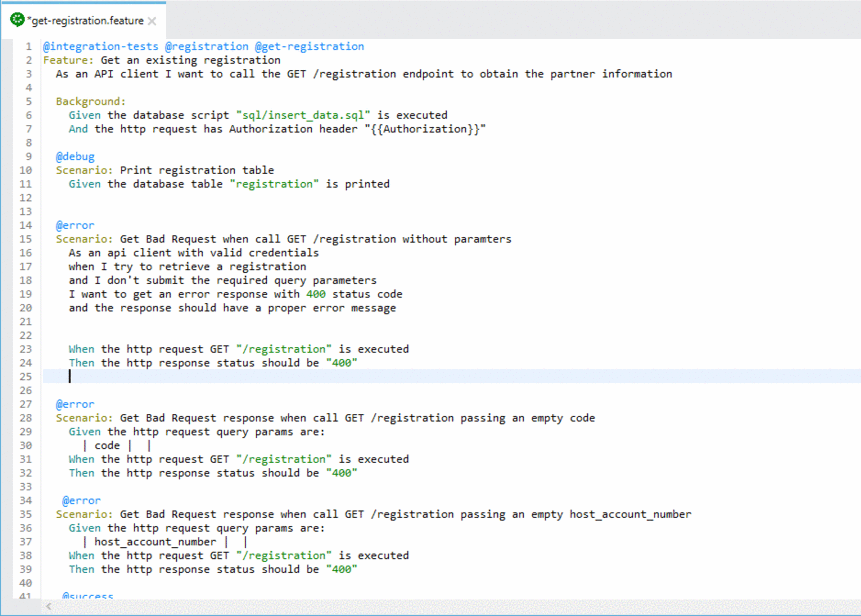

# Cucumbersome


[](https://sonarcloud.io/dashboard?id=mariocairone_cucumbersome)


   

[](https://sonarcloud.io/dashboard?id=mariocairone_cucumbersome) [](https://sonarcloud.io/dashboard?id=mariocairone_cucumbersome) [](https://sonarcloud.io/dashboard?id=mariocairone_cucumbersome)

[](https://sonarcloud.io/dashboard?id=mariocairone_cucumbersome) [](https://sonarcloud.io/dashboard?id=mariocairone_cucumbersome) [](https://sonarcloud.io/dashboard?id=mariocairone_cucumbersome) [](https://sonarcloud.io/dashboard?id=mariocairone_cucumbersome) [](https://sonarcloud.io/dashboard?id=mariocairone_cucumbersome)


Cucumbersome is a small framework created to speed up the testing process using cucumber framework.
The scope of the framework is to provide a collection of predefined steps to test system integrations using the following technologies:
- HTTP
- AMQP
- SQL        

Here is the list of available modules:
- [core](core/README.md)
- [http](http/README.md)
- [database](database/README.md)
- [mock](mock/README.md)
- [rabbitmq](rabbitmq/README.md)
- [variables](variables/README.md)

## Features
- Pre-Defined Steps definition for the supported transports.
- Integrated [Template Engine][30bd4b1c], everywhere you can pass a String it can be a template.
- Better with [TestContainers][ed98778a]
- Works with [Cucumber Eclipse Plugin][1790edb3]     


## Getting Started

* Add dependencies for each module you wish to use in your `pom.xml`

```xml
<dependency>
  <groupId>com.mariocairone.cucumbersome</groupId>
  <artifactId>[module name]</artifactId>
  <version>1.0.0.alpha</version>
  <scope>test</scope>
</dependency>

```

You can also build the `.jar` files yourself, assuming you have Maven and JDK 1.8+ installed:
```shell
mvn clean install
```
The resulting `.jar` files will be located in the modules `target/` folder.

You can also find `SNAPSHOT` builds of the latest and greatest changes to the master branch in the SonaType snapshots repository.

To add that snapshot repository to your Maven pom.xml use the following snippet:
```xml
<repositories>
    <repository>
        <id>oss-sonatype</id>
        <name>oss-sonatype</name>
        <url>https://oss.sonatype.org/content/repositories/snapshots/</url>
        <snapshots>
            <enabled>true</enabled>
        </snapshots>
    </repository>
</repositories>
```

* Create the test class with the package glue __com.mariocairone.cucumbersome.steps__   

```java
import io.cucumber.junit.Cucumber;
import io.cucumber.junit.CucumberOptions;
import org.junit.runner.RunWith;

@RunWith(Cucumber.class)
@CucumberOptions(plugin = { "pretty", "html:target/cucumber",
"json:target/cucumber/cucumber.json",
"junit:target/cucumber/cucumber.xml"},
    glue = {"com.mariocairone.cucumbersome.steps"},
    features = "classpath:features",
    strict = true)
public class CucumbersomeIT  {

}
```

* (Optional) Create the configuration file `cucumbersome.properties`.   
<br/>

Example:
  ```
  http.request.log=true
  http.response.log=true
  http.request.baseUrl=http://localhost
  http.request.basePath=/
  http.request.port=8080
```

*Please refer to the module documentation for the list of available properties.*

* Write your feature file

  

* Run the test

```shell
mvn clean verify
```

## Prerequisites

To build the framework the following tools are required:

* Java Development Kit 1.8
* Maven
* Docker

## Installing

Clone the repository and install the framework in your maven repository running the following command:

```shell
mvn clean install
```

## Running the tests

```shell
mvn clean test
```

## Deployment

To Deploy the framework in your remote maven repository:

* configure the distribution management section in the parent pom

* run the command:

```shell
mvn clean deploy
```

## Built With

* [Maven](https://maven.apache.org/) - Dependency Management

## Contributing

Please read [CONTRIBUTING.md](CONTRIBUTING.md) for details on our code of conduct, and the process for submitting pull requests to us.

## Versioning

We use [SemVer](http://semver.org/) for versioning. For the versions available, see the [tags on this repository](https://github.com/mariocairone/cucumbersome/tags).

## Authors

* **Mario Cairone** - *Initial work*

See also the list of [contributors](https://github.com/mariocairone/cucumbersome/contributors) who participated in this project.

## License

This project is licensed under the MIT License - see the [LICENSE.md](LICENSE.md) file for details


[30bd4b1c]: https://github.com/badlogic/basis-template "Basis Template"
[ed98778a]: https://www.testcontainers.org/ "TestContainers"
[1790edb3]: https://marketplace.eclipse.org/content/cucumber-eclipse-plugin "Cucumber Eclipse Plugin"
